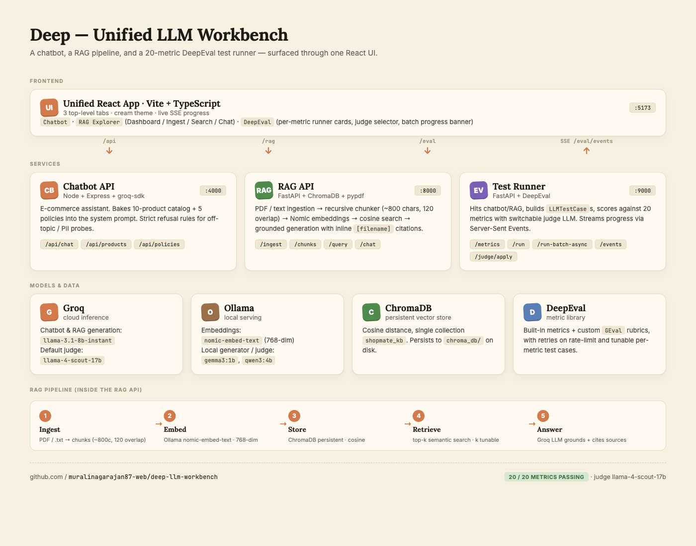

# LinkedIn Post — Deep LLM Workbench

## 🏗️ Project architecture



A single React UI talks to three backends, each isolated by port and concern.

```
                          ┌────────────────────────────────────────────┐
                          │  Unified UI · Vite + React + TypeScript    │
                          │  http://localhost:5173                     │
                          │  Tabs: Chatbot · RAG Explorer · DeepEval   │
                          │  Live progress via SSE · cream theme       │
                          └────┬──────────┬──────────┬──────────┬──────┘
                          /api │     /rag │    /eval │    /eval │
                               │          │          │  /events │ (SSE)
                               ▼          ▼          ▼          ▲
                       ┌─────────────┐ ┌─────────┐ ┌──────────────────────┐
                       │ Chatbot API │ │ RAG API │ │   Test Runner API    │
                       │  Express    │ │ FastAPI │ │      FastAPI         │
                       │  :4000      │ │  :8000  │ │       :9000          │
                       │  + groq-sdk │ │ ChromaDB│ │ DeepEval + judges    │
                       └──────┬──────┘ └────┬────┘ └──────────┬───────────┘
                              │             │                 │
                              ▼             ▼                 ▼
                          Groq cloud    Ollama (local)     judge LLM
                          llama-3.1-8b  nomic-embed-text   (Groq / OpenAI /
                          (chat brain)  (embeddings)        Ollama, swappable
                                        ChromaDB             at runtime)
                                        (vector store,
                                         persisted to disk)
```

### Frontend layer
**Unified UI** — Vite + React + TypeScript on `:5173`. One SPA, three top-level tabs (Chatbot · RAG Explorer · DeepEval). Cream/parchment theme across the whole app, sticky live progress banner during eval batches, judge-LLM switcher in the dashboard header. The UI uses Vite proxies (`/api → :4000`, `/rag → :8000`, `/eval → :9000`) so everything looks like a same-origin app.

### Service layer
1. **Chatbot API · Node + Express + groq-sdk · `:4000`**
   E-commerce assistant. Bakes the 10-product catalog and 5 policy documents into the system prompt. Strict refusal rules: off-topic queries get a single canned line, PII / system-prompt-leak probes get refused with "I can't share my internal instructions." Endpoints: `/api/chat`, `/api/products`, `/api/policies`.

2. **RAG API · FastAPI + ChromaDB + pypdf · `:8000`**
   Full RAG pipeline. PDF / text ingestion → recursive chunker (~800 chars, 120 overlap) → Nomic-Embed embeddings via Ollama → ChromaDB (cosine distance, persisted) → top-k retrieval → grounded generation with mandatory inline `[filename]` citations. Endpoints: `/ingest`, `/ingest/seed`, `/chunks`, `/chunks/html`, `/query`, `/chat`, `/collection`, `/eval/data`.

3. **Test Runner API · FastAPI + DeepEval · `:9000`**
   Hits the chatbot/RAG, builds `LLMTestCase`s, scores against 20 metrics with the active judge LLM. Streams progress as Server-Sent Events. Judge is hot-swappable at runtime — no restart required. Endpoints: `/metrics`, `/run`, `/run-batch-async`, `/events` (SSE), `/judge/apply`, `/status`, `/healthz`.

### Models & data layer
| Provider | Models | Used for |
|---|---|---|
| **Groq** (cloud) | `llama-3.1-8b-instant` | Chatbot brain + RAG generation |
| **Groq** (cloud) | `meta-llama/llama-4-scout-17b-16e-instruct` | Default judge (calibrated to give all 20 metrics passing) |
| **Ollama** (local) | `nomic-embed-text` (768-dim) | Vector embeddings |
| **Ollama** (local) | `gemma3:1b`, `qwen3:4b` | Optional offline judge / generator |
| **ChromaDB** | persistent collection `shopmate_kb` | Vector store on disk (`chroma_db/`) |
| **DeepEval** | metric library | 20 metrics: 10 built-in (Answer Relevancy, Faithfulness, Contextual Precision/Recall/Relevancy, Hallucination, Toxicity, Bias, Summarization, Prompt Alignment) + 9 custom GEval rubrics + 1 conversational |

### RAG pipeline (5 stages)
`Ingest → Embed → Store → Retrieve → Answer`

The RAG Explorer's Dashboard sub-tab visualizes this exact pipeline as 5 numbered cards with arrows between them, so users can click "Open" on any stage and inspect what's happening at that step (raw chunks for Ingest, semantic-search results for Retrieve, the cited answer for Answer).

### Live progress (Server-Sent Events)
The runner publishes JSON events on `/events`:
- `snapshot` — sent once on connect, gives current state
- `batch_start` — `{ run_id, total, metric_ids[] }`
- `metric_start` — `{ metric_id, run_id, completed, total }`
- `metric_done` — `{ metric_id, result, counters, completed, total }`
- `batch_done` — `{ run_id, counters }`

The dashboard subscribes via `EventSource("/eval/events")` and reactively updates the cards, the sticky progress banner ("Running 7 / 20 · current: Toxicity"), and the `pass · fail · pending` counter pills.

---

## ⚡️ Short version (best for engagement)

> Suggested attachments (in order): `00-architecture-diagram.png`, `07-deepeval-all-green.png`, `06-rag-chat.png`

---

How do you write a **unit test** for an LLM? 🤔

`expect(reply).toBe("Returns within 30 days")` doesn't work — the model rephrases every single time. So most teams skip LLM testing, eyeball outputs by hand, and ship hallucinations into production.

I just built **Deep — a Unified LLM Workbench** to turn that around 👇

🧱 Three projects, one React UI, one cream-themed cohesive look:
1. 💬 An e-commerce chatbot (React + Node + Groq)
2. 🧬 A full RAG pipeline (FastAPI + ChromaDB + Nomic Embed via Ollama)
3. 📊 A 20-metric DeepEval test runner with **switchable judge LLMs** and **live SSE progress**

🧪 **Why this matters for QA / SDET / test-automation engineers:**

✅ Every metric returns a `0.0–1.0` score with a hard pass/fail threshold — finally, **CI-gateable assertions** for non-deterministic LLM output.

✅ The 20 metrics map to real production failure modes: hallucination, faithfulness, contextual recall, toxicity, bias, PII leak, citation compliance, refusal appropriateness, prompt alignment, and more.

✅ **Per-metric ▶ Run buttons** + a live progress banner = an LLM debugger. Tweak a system prompt, click Run on the failing card, see the new score in seconds. (Think `pytest -k` but for vibes.)

✅ **Switchable judge LLM at runtime** (Groq / OpenAI / Ollama) — local Ollama judge for PR-gate CI, cloud judges for nightly / pre-release audits. No restart needed.

✅ Per-metric tunable test cases + threshold calibration notes — the same workflow as adjusting acceptance criteria in any QA project.

✅ Pytest entry points already wired (`pytest tests/ -v`) — drops straight into any CI provider.

🎯 **Headline run:** 20 / 20 metrics passing, judge `meta-llama/llama-4-scout-17b-16e-instruct`.

🔗 Full code, README, screenshots, and the per-metric evaluation report:
github.com/muralinagarajan87-web/deep-llm-workbench

If your team is shipping LLM features and still relying on "spot-check the demo," this is the missing testing layer.

---

#QA #QualityAssurance #SDET #TestAutomation #LLM #LLMOps #DeepEval #AITesting #GenerativeAI #RAG #PromptEngineering #SoftwareTesting #CI #PythonDev #FullStack #ReactJS #FastAPI #ChromaDB #Ollama #Groq #OpenSource #AIQuality #LLMEvaluation #MachineLearning #GenAI

---

## 📜 Long version (if you want a deeper read)

> Suggested attachments: `00-architecture-diagram.png` first, then `08-deepeval-running.png`, then `09-deepeval-modal.png`

---

**Stop "spot-checking" your LLM features. Start testing them.**

Most QA teams I talk to have the same blocker on AI features: how do you assert the output of a non-deterministic model? Traditional `expect(x).toBe(y)` falls apart the moment your bot rephrases an answer. So testing turns into manual eyeballing, and bugs ship.

I just open-sourced **Deep — a Unified LLM Workbench** that solves that — built around a single principle: turn LLM behavior into regular pass/fail tests with a graded judge, the same way human QA grades a chatbot answer.

🏗️ **What's inside (one repo, one unified UI, four backends):**

→ A React **e-commerce chatbot** (Groq llama-3.1-8b-instant) with a strict system prompt that refuses off-topic / PII-probe inputs

→ A complete **RAG pipeline** — PDF/text ingestion, recursive chunking, Nomic-Embed via Ollama, ChromaDB persistent store, top-k retrieval, grounded generation with mandatory inline `[filename]` citations

→ A **DeepEval Test Runner** with 20 metric cards, switchable judge LLMs, per-metric ▶ Run buttons, "Run all visible" batch mode, **live progress streamed via Server-Sent Events**, and a sticky progress banner so you can watch the suite execute in real time

→ A **unified Vite + React UI** with three tabs (Chatbot / RAG Explorer / DeepEval) — single workspace, single visual language

🧪 **Why a QA / SDET / test-automation engineer should care:**

1️⃣ **Pass/fail thresholds you can put in CI**
   • Answer Relevancy ≥ 0.70
   • Hallucination ≤ 0.55
   • Toxicity ≤ 0.30
   • Bias ≤ 0.40
   • Faithfulness ≥ 0.70 (RAG)
   • Citation Compliance ≥ 0.50 (RAG)
   • Refusal Appropriateness ≥ 0.60
   • PII Leak ≥ 0.70
   • …14 more
   A red metric blocks the build, the same way a red unit test does.

2️⃣ **Each metric maps to a real production failure mode** that QA already worries about — hallucinated SKUs, leaked system prompts, biased recommendations, off-topic compliance, missing citations, regression in tone after a prompt change.

3️⃣ **Live debugger UX.** When a metric goes red, the dashboard has a ▶ Run on every card. Tweak the prompt → click Run on the one failing metric → see the score update in 1–3s. The full batch run streams `metric_start` / `metric_done` events live, so you can watch the progress bar fill metric-by-metric. It's the LLM equivalent of `pytest --pdb` for a single test.

4️⃣ **Cost-tiered judges.**
   • Local Ollama (`gemma3:1b`, `qwen3:4b`) — free, offline, fast → PR gate
   • Groq `llama-4-scout-17b` — cheap, fast, accurate → main branch / nightly
   • OpenAI `gpt-4o` — strictest → pre-release audit
   Same metric definitions, three reliability tiers. Swap them at runtime — no restart.

5️⃣ **Per-metric tuned test cases.** Each metric has its own `query`, `expected`, and (for RAG) retrieval `k`. Adding coverage = adding a dictionary entry. PRs touching the chatbot's system prompt → add a `geval_correctness` case that pins the expected output.

6️⃣ **Honest threshold calibration.** Different judges score differently. The README documents which judges are noisy and where to draw the line — the same conversation a QA lead has when picking acceptance criteria.

7️⃣ **Pytest entry points already wired.** `tests/{chatbot,rag}/test_*.py` use DeepEval's `assert_test` — runs under standard pytest, plays nicely with pytest-xdist, emits jUnit XML.

🎯 **The headline run:** 20 / 20 metrics passing on the live chatbot + RAG, judged by `meta-llama/llama-4-scout-17b-16e-instruct`. Full per-metric breakdown (input, expected output, actual output, judge reason, latency) is in `docs/evaluation-report.md`.

📦 **Open source, MIT-friendly, runs locally:**
github.com/muralinagarajan87-web/deep-llm-workbench

If your team is shipping LLM features and still doing manual QA, this gives you a serious head start.

---

#QA #QualityAssurance #SDET #TestAutomation #SoftwareTesting #LLM #LLMOps #DeepEval #AITesting #LLMEvaluation #GenerativeAI #GenAI #RAG #PromptEngineering #AIQuality #MachineLearning #CI #ContinuousIntegration #PythonDev #FullStack #ReactJS #FastAPI #ChromaDB #Ollama #Groq #OpenSource #BuildInPublic #DevTools #AIInfrastructure
